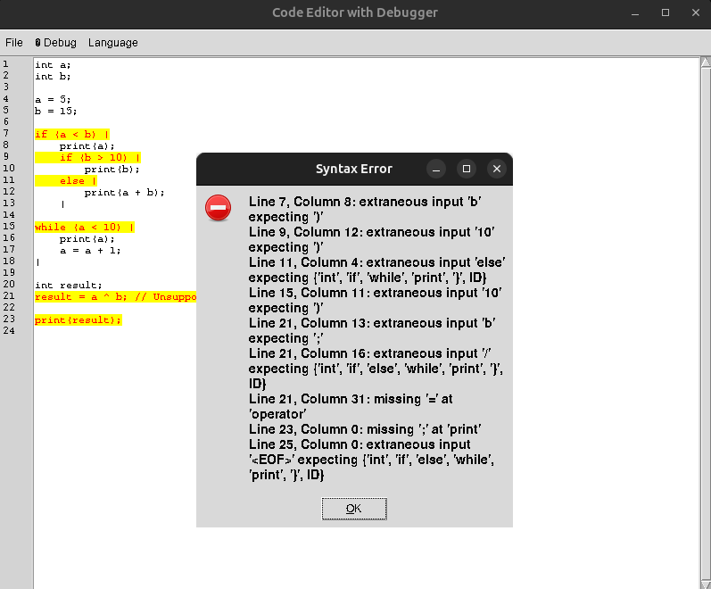

# Code Editor with Debugger

A versatile toolkit for debugging syntax errors, generating grammars

<p align="center">
  
</p>


## Features

- **Syntax Highlighting & Error Handling**: Using ANTLR, the editor can parse custom language files, displaying syntax errors with line and column information.
- **File Management**: Supports file operations like Open, Save, and Save As for loading and saving code.
- **Debugging Interface**: Debug code with an integrated debugging function that shows token parsing and errors.
- **Undo/Redo & Shortcuts**: Supports undo/redo actions and common keyboard shortcuts like Cut, Copy, Paste, and Select All.
- **Line Numbers**: Real-time line number display alongside the text editor.
- **Customizable**: You can integrate your own ANTLR grammar files for different languages.

## Usage

### 1. **Opening and Saving Files**
- **Open File**: Use the **File > Open** menu option to open a code file.
- **Save File**: Save the file via **File > Save** or **File > Save As**.

### 2. **Editing Code**
- The editor has full text editing capabilities with keyboard shortcuts such as:
  - **Ctrl+X**: Cut
  - **Ctrl+C**: Copy
  - **Ctrl+V**: Paste
  - **Ctrl+Z**: Undo
  - **Ctrl+Y**: Redo
  - **Ctrl+A**: Select All

### 3. **Running Debug**
- **Debugging**: Use **🐞 Debug > Run Debug** to start debugging. The editor will parse the code using your grammar, and you will see parsed tokens along with any errors that occur during parsing.

### 4. **Syntax Error Reporting**
- Any syntax errors detected during parsing will be displayed with detailed information (line, column, and message).

## Requirements

- Python 3.x
- Tkinter (for GUI)
- ANTLR4 for Python
- Custom language grammar files (Lexer and Parser) for ANTLR

## Setup

1. Install the necessary Python libraries:
   ```bash
   pip install antlr4-python3-runtime
   ```
2. Ensure you have your custom grammar files for the lexer and parser (e.g., `MyLanguageLexer.py` and `MyLanguageParser.py`).
3. Generate Lexer, Parser, Listener, and Visitor with ANTLR:
   ```
   antlr4 -Dlanguage=Python3 JavaLexer.g4
   antlr4 -Dlanguage=Python3 JavaParser.g4
   ```
4. Run the script and enjoy editing and debugging your code!

## Contributing

Feel free to fork this project, raise issues, or create pull requests for new features or bug fixes.

## References

https://www.antlr.org/

https://gnucobol.sourceforge.io/
